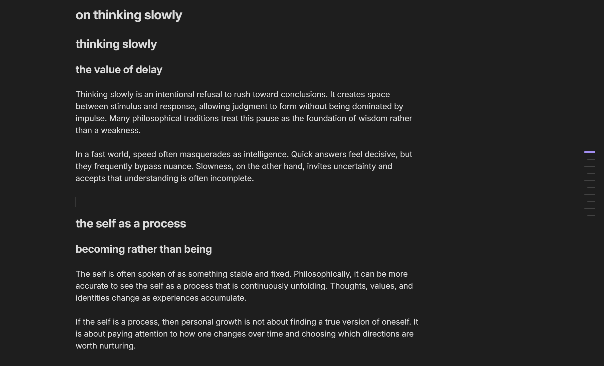
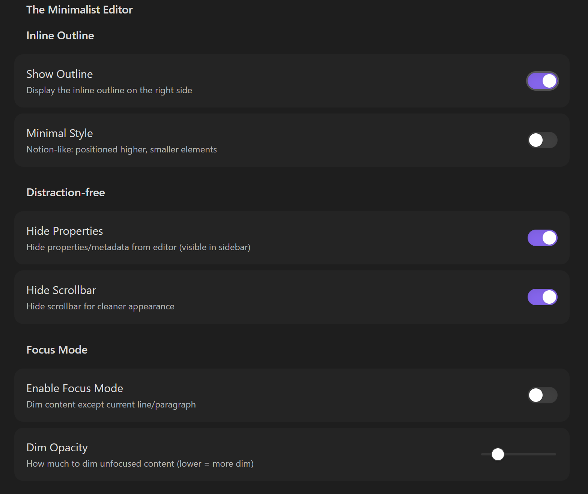

# The Minimalist Editor

A distraction-free writing plugin for Obsidian featuring an inline outline, focus mode, and clean UI options.

## Features

### Inline Outline

A Notion-style table of contents that appears on the right side of your editor.

- **Collapsed state**: Shows minimal horizontal lines representing heading hierarchy
- **Hover to expand**: Reveals full heading text with indentation
- **Click to navigate**: Jump to any section instantly
- **Active tracking**: Highlights the current heading as you scroll
- **Two styles available**:
  - Standard (centered, larger elements)
  - Minimal (top-positioned, compact)

### Focus Mode

Dims all content except the line you're currently editing, helping you concentrate on your writing.

- Works in both Edit and Reading modes
- Highlights current line/paragraph with full opacity
- Adjacent lines shown at intermediate opacity for context
- Configurable dim opacity (10-70%)
- Smooth transitions between focused elements

### Distraction-Free Options

- **Hide Properties**: Removes frontmatter/metadata from the editor (still accessible in sidebar)
- **Hide Scrollbar**: Removes scrollbars for a cleaner appearance

## Installation

### From Obsidian Community Plugins

1. Open Obsidian Settings
2. Go to Community Plugins and disable Safe Mode
3. Click Browse and search for "The Minimalist Editor"
4. Install and enable the plugin

### Manual Installation

1. Download the latest release from GitHub
2. Extract to your vault's `.obsidian/plugins/the-minimalist-editor/` folder
3. Reload Obsidian
4. Enable the plugin in Settings → Community Plugins

## Usage

### Settings

Access plugin settings via **Settings → The Minimalist Editor**

| Setting | Description |
|---------|-------------|
| Show Outline | Toggle the inline outline visibility |
| Minimal Style | Use compact Notion-like outline style |
| Hide Properties | Hide frontmatter from editor view |
| Hide Scrollbar | Remove scrollbars from editor |
| Enable Focus Mode | Activate focus dimming |
| Dim Opacity | Adjust how much unfocused content is dimmed |

### Commands

Available via Command Palette (Ctrl/Cmd + P):

- **Toggle Inline Outline**: Show/hide the outline
- **Toggle Focus Mode**: Enable/disable focus dimming

### Keyboard Shortcuts

You can assign custom hotkeys to the commands above in **Settings → Hotkeys**.

## Compatibility

- Requires Obsidian v0.15.0 or higher
- Desktop only (Windows, macOS, Linux)
- Works with both Edit and Reading modes

## Support

- Report issues on [GitHub](https://github.com/litegral/the-minimalist-editor/issues)
- Contributions welcome via pull requests

## License

MIT License - see [LICENSE](LICENSE) for details
